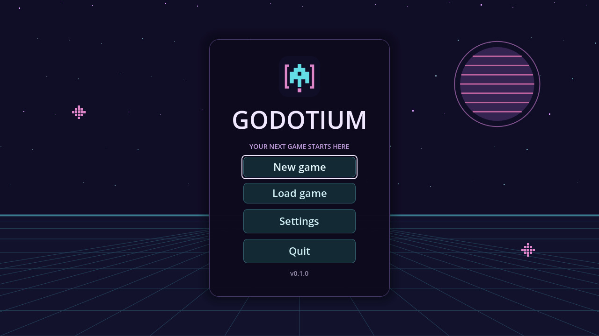

# Godotium

An **MIT-licensed Godot 4+ C++ starter** with a Chromium-style GN/Ninja build
workflow and standalone desktop packages. Godotium builds Godot and its C++
bindings from pinned sources, then packages the game into `out/<name>/dist/`.
It is an independent starter project, not an official Godot distribution.

Game code and assets live in [`src/godotium/`](src/godotium), with separate GN
modules for scenes, music playback and localization. Build infrastructure lives
in `src/build/`, and upstream dependencies in `src/third_party/`. Gameplay uses
C++17 (`.cc` / `.h`) through GDExtension with Chromium formatting.

**Start reading at [`src/project.godot`](src/project.godot):** its `run/main_scene`
setting selects the startup `.tscn` scene. See [Where the game starts](#where-the-game-starts)
for the path from project configuration to C++ behavior.

The playable demo starts a timer, pauses with Esc, and saves or loads named games.
Separate scenes provide the main menu, settings, save form and load list; a small
engine-independent `game_state` library demonstrates reusable C++ game logic.
See [Scene architecture](docs/scene-architecture.md) to adapt this loop to your game.
The demo also includes keyboard/mouse navigation, English and Russian localization,
persistent preferences, an SVG background and two gentle CC0 arcade-puzzle tracks.

- Host-native release defaults on macOS ARM64, Windows x64 and Linux x64.
- Windows/Linux cross compilation from an Apple Silicon Mac.
- Direct GN/Ninja C++ library compilation and archive linking into GDExtension.
- Music and sound buses, per-track playback controls, fullscreen and VSync.
- Named saves with separate create/overwrite actions and deletion from the load list.
- Standalone exports, macOS ad-hoc signing, bundled license notices and UI tests.
- Manual GitHub Actions builds; pushes do not start CI.
- MIT-licensed starter code and original visuals, usable in commercial games.



## Start your own game

Click **Use this template** on GitHub to create your own repository, or clone
Godotium to explore it. The build commands below work directly after cloning.
For a new game, set both `config/name` and `config/custom_user_dir_name` under
`[application]` in `src/project.godot`. The custom directory is explicitly set to
`Godotium`, so changing the display name alone does not separate your saved data.
Choose a unique, stable directory name before distributing your game.

Update executable/library filenames, C++ namespace, `GODOTIUM_*` environment
variables and bundle identifier consistently in the component `BUILD.gn` files,
build scripts/configs/tests, `src/godotium/`, `src/project.godot`,
`src/godotium.gdextension`, and root launch scripts. Follow the
[game replacement steps](docs/scene-architecture.md) to replace the timer state,
gameplay scene and save format while reusing the menu and forms. Replace the icon
and music as desired; keep applicable license notices in your distribution.

The main menu displays the version from `application/config/version` in
`src/project.godot`. Use that same version for a release tag (for example,
`v0.1.0`); save-format versions are independent.

## Quick start on macOS and Linux

Supported hosts are Apple Silicon Macs, x64 Windows and x64 Linux. Install
Python 3.11.8 or newer and ensure `python3` (Unix) or `python` (Windows) is available.
The first build needs internet access and several GB of disk space.

On Mac, install Apple's Command Line Tools (`xcode-select --install`).
On Ubuntu/Debian, install the native compiler and Python dependencies:

```sh
sudo apt-get update
sudo apt-get install build-essential pkg-config python3-venv curl
```

Ubuntu 22.04's default Python is older than 3.11; install a newer Python separately.
The CI uses Ubuntu 22.04 with Python 3.11 and the system GCC.

```sh
git clone https://github.com/maximpodg/godotium.git
cd godotium
source ./build_tools.sh
cd src
gn gen out/Default
ninja -C out/Default godotium
open out/Default/dist/Godotium.app # Mac
# On Linux: out/Default/dist/godotium
```

`source ./build_tools.sh` installs pinned GN and Ninja into `.tools/bin` and
prepends that directory to the current terminal's `PATH`. It supports Bash and
Zsh. Repeat it in each new terminal; installed tools are reused. It does not edit
shell startup files. Project tools take precedence over Chromium's `depot_tools`.

If you execute `./build_tools.sh` instead, it installs the files but cannot change
the parent shell's `PATH`. Afterwards run `export PATH="$PWD/.tools/bin:$PATH"`
from the repository root, or use `../.tools/bin/gn` and `../.tools/bin/ninja` in `src`.

## Quick start on Windows

Use PowerShell with x64 Python 3.11.8+ on PATH. Windows supplies `curl.exe`;
GN/Ninja and the pinned LLVM-MinGW compiler are downloaded automatically.
Visual Studio and Bash are not required.

```powershell
git clone https://github.com/maximpodg/godotium.git
cd godotium
.\build_tools.ps1
cd src
gn gen out/Default
ninja -C out/Default godotium
.\out\Default\dist\godotium.exe
```

Repeat `build_tools.ps1` in each new terminal to activate the local tools.
If PowerShell blocks local scripts, run
`Set-ExecutionPolicy -Scope Process -ExecutionPolicy Bypass` in that terminal first.

## Target platforms and build arguments

With a fresh output directory, `gn gen out/Default` selects the current host OS
and architecture and a release build. GN evaluates defaults in the build files;
it does not copy all default values into `args.gn`. Existing explicit overrides
in `out/Default/args.gn` survive subsequent `gn gen out/Default` commands.
Use `gn args out/Default --list --short` to inspect argument defaults and overrides.
Empty `target_os` / `target_cpu` values in this list mean automatic selection by
the build configuration. `gn desc out/Default //third_party:godot_template args` shows the
resolved platform and release/debug mode passed to the runtime build.

Run from `src` after activating the tools. Mac can also cross-compile to Windows
and Linux; Windows and Linux hosts currently build their own platform:

```sh
gn gen out/Mac --args='target_os="mac" target_cpu="arm64" is_debug=false'
gn gen out/Win --args='target_os="win" target_cpu="x64" is_debug=false'
gn gen out/Linux --args='target_os="linux" target_cpu="x64" is_debug=false'

ninja -C out/Mac godotium
ninja -C out/Win godotium
ninja -C out/Linux godotium
```

The directory name does not select the platform; the GN arguments do. Supported
combinations are `mac/arm64`, `win/x64` and `linux/x64`. Intel Mac targets are not
supported. The build configuration supports native builds on all three host platforms.

| Argument | Default | Effect |
| --- | --- | --- |
| `target_os` | Host OS (`mac`, `win` or `linux`) | OS of the game, not the export editor |
| `target_cpu` | Host CPU; `x64` when cross-compiling to Windows/Linux | Architecture of the game |
| `is_debug` | `false` | `true`: debug template and debug export; `false`: release template and release export |
| `godot_dev_build` | `false` | Developer assertions/symbols in the **host editor** only |
| `godot_jobs` | `4` | SCons compilation parallelism; lower it to reduce memory use |

For example, to build a debug game:

```sh
gn gen out/MacDebug --args='target_os="mac" target_cpu="arm64" is_debug=true'
ninja -C out/MacDebug godotium
```

The game always uses an export template without the editor. `is_debug=true` adds
Godot's runtime debugging support; it does not embed the editor in the game.
The native host editor is needed to import resources and export each target platform.
SCons builds sharing an engine source tree are serialized, including across
separate Ninja invocations. Export stages use isolated project copies.

## Cross compilation from Mac

Windows builds automatically download a pinned LLVM-MinGW toolchain into the
repository's `.tools/` directory and verify its SHA-256. The template uses
statically linked C++ libraries and the OpenGL renderer. The runtime is compiled with the game's multi-resolution ICO, so the exported
EXE has its own icon without Wine/rcedit. Export preserves those resources;
Windows version metadata still comes from the pinned Godot runtime.

Linux cross builds from Mac require a running Docker-compatible engine.
Native Linux builds use the system compiler and do not need Docker. For example, using
Colima on the Mac:

```sh
brew install colima docker
colima start --profile godotium --cpu 8 --memory 12 --disk 40 --vm-type vz --vz-rosetta
```

Docker Desktop can also be used. Ninja uses the active Docker context; if needed,
select Colima with `docker context use colima-godotium`. Colima can be stopped
when builds finish with `colima stop --profile godotium`.

Ninja builds the Linux toolchain container from `src/build/docker/Dockerfile`.
The ARM64 container runs natively on Apple Silicon and uses an x86_64 cross
compiler. The baseline is Ubuntu 22.04 / glibc 2.35, with static C++ runtime
libraries and X11/XWayland display support. Native Wayland is disabled in this
initial configuration. The game must still be tested with the intended Steam
Linux Runtime and on actual target systems before release.

## Distribution files

**The complete contents of `dist/` are the files to distribute.**

| Build directory | Distribution contents |
| --- | --- |
| Mac build (e.g. `out/Mac`) | `dist/Godotium.app` (entire bundle) |
| Windows build (e.g. `out/Win`) | `godotium.exe`, `godotium.pck`, `libgodotium_win.dll`, `licenses/` |
| Linux build (e.g. `out/Linux`) | `godotium`, `godotium.pck`, `libgodotium_linux.so`, `godotium.desktop`, `godotium.svg`, `licenses/` |

PCK files contain scenes, translations, music and other resources. Keep both the
PCK and native gameplay library next to the Windows/Linux executable. Mac bundles
contain the PCK in `Contents/Resources` and the C++ library in `Contents/Frameworks`.
License notices are in `licenses/` (inside `Contents/Resources` on Mac). Export
copies the pinned Godot license, Godot third-party copyrights, godot-cpp license,
and music credits with the full CC0 text. Mac signing runs after these are included.
No external source checkout or `--path game` is needed to run a distribution.

Windows embeds `godotium/resources/icons/godotium.ico` in the runtime template.
After editing the SVG, regenerate and commit the ICO from the repository root:

```sh
src/out/Default/bin/godot --headless --script src/build/scripts/generate_windows_icon.gd -- src/godotium/resources/icons/godotium.svg src/godotium/resources/icons/godotium.ico
```

On a Windows host use `bin/godot.exe`. The ICO contains seven sizes from 16 to
256 pixels. Changing it rebuilds the Windows template and export; the Godot
editor retains its original icon.

Linux includes the SVG icon and a standard `.desktop` entry for system packaging.
Steam launches the configured executable directly and does not run a desktop
installer. The `.desktop` file is optional packaging metadata, not a Steam install
step. Upload Steam client/shortcut icons separately in Steamworks; the game window
uses the icon configured in `project.godot`.

For Steam, map each platform's `dist/` contents to its depot. Configure launch
options for `Godotium.app`, `godotium.exe` or `godotium` as appropriate.
The build does not upload anything to Steam. Signing/notarization for public
macOS distribution and Steamworks integration are separate release tasks; the
current Mac app receives a local ad-hoc signature automatically during export
(`codesign` identity `-`), on both developer Macs and GitHub Actions. An Apple
Developer certificate is not required for this build. Tests verify the complete
bundle signature and explicitly check `Signature=adhoc`.

Editor binaries (`bin/`), export templates (`templates/`), generated Ninja files,
logs and intermediate files remain outside `dist/`. Successful exports replace
`dist/` completely so stale dependencies do not survive a platform change or
resource deletion.

## C++ libraries built with GN/Ninja

GN/Ninja directly compiles C++17 libraries with a native or cross C++ toolchain.
The [`game_state`](src/godotium/game_state/README.md) library demonstrates how
this works: GN compiles its engine-independent timer state and simulation rules
into `libgame_state.a`, and
SCons links that archive into the game's GDExtension. Settings remain ordinary
application code in `GameSettings`.
Godot, godot-cpp and the Godot adapters retain their SCons build machinery.

After activating the build tools, run from `src`:

```sh
gn gen out/Default
ninja -C out/Default godotium
```

The game target automatically builds and links `game_state`. Use
`ninja -C out/Default game_state` only to build the library on its own.

The standalone library target defaults to the host platform. Game builds select
matching archives automatically, including Windows and Linux cross exports from
macOS. The toolchains use system C++ tools on native macOS/Linux, pinned
LLVM-MinGW for Windows, and the project's Docker cross compiler for Linux
exports from macOS.

See [game_state](src/godotium/game_state/README.md) for the API boundary,
archive paths, and how to move a library into a separate dependency repository.

## Repository layout and useful commands

```text
godotium/
  build_tools.sh       # Unix: install GN/Ninja and activate PATH when sourced
  build_tools.ps1      # Windows: install GN/Ninja and activate PATH
  build.sh             # Optional build shortcut for src/out/Default
  run.sh               # Unix launch shortcut; --editor opens editor
  licenses/            # Third-party asset notices; bundled during export
  .tools/              # Downloaded host tools and Windows toolchain (ignored)
  src/                 # GN source root; run gn and ninja here
    .gn
    BUILD.gn           # Public godotium/all entry points
    build/             # GN config, internal scripts, Linux Dockerfile and tests
    project.godot      # Godot project configuration; res:// starts at src/
    godotium.gdextension # Native library entry point and platform paths
    godotium/          # Our game, with its own BUILD.gn
      register_types.cc # Extension entry point; delegates class registration
      scenes/          # Scene C++ and .tscn files; own BUILD.gn
        main_scene/    # Composition and screen transitions
        game_scene/    # Replaceable timer demo
        main_menu/     # Startup and pause actions
        save_dialog/   # Name, create and overwrite actions
        load_dialog/   # Saved-game selection
        settings_scene/
      game_state/      # Engine-independent C++ static library
      save_repository/ # Serialization and named-slot storage
      music_player/    # C++ music playback and registration; own BUILD.gn
      localization/    # Supported locale matching; own BUILD.gn
      settings/        # GameSettings autoload; loads/applies/saves preferences
      resources/       # Music, sounds, translations, themes and icons
    third_party/       # Version pins and downloaded Godot sources
    .tools/venv/       # Project-local SCons (ignored)
    out/               # Build directories, each with its own dist/ (ignored)
```

Build responsibilities are split into small component files. `BUILD.gn` files
declare targets; `.gni` files contain shared settings and reusable templates.

| File | Responsibility |
| --- | --- |
| `src/BUILD.gn` | Public build entry points and console pool |
| `src/godotium/BUILD.gn` | Game modules, source manifest and target/host libraries |
| `src/build/config/BUILDCONFIG.gn` | Resolve host/target defaults and select the toolchain |
| `src/build/config/godot.gni` | Debug/release arguments, supported platforms and output paths |
| `src/build/tools/BUILD.gn` | Provision SCons, LLVM-MinGW and the Linux build container |
| `src/third_party/BUILD.gn` | Fetch pinned Godot/godot-cpp; build the editor and runtime |
| `src/build/game_library.gni` | Reusable GDExtension build action |
| `src/godotium/music_player/BUILD.gn`, `src/godotium/localization/BUILD.gn`, `src/godotium/scenes/BUILD.gn`, `src/godotium/settings/BUILD.gn` | Module sources and dependencies |
| `src/build/game_module.gni` | Module metadata collected into the C++ source manifest |
| `src/build/export/BUILD.gn` | Asset list, export, licenses and final distribution outputs |

See [Project structure](docs/project-structure.md) for the build graph and examples
of adding C++ code, assets, translations or a dependency.

## Game integration tests

From `src`, after the quick-start build (use `python` instead of `python3` on Windows):

```sh
python3 build/tests/test_build_inputs.py
python3 build/tests/test_source_project.py out/Default
python3 build/tests/test_distribution.py out/Default mac
```

Use `win` or `linux` instead of `mac` for that target's distribution. For separate
cross-build directories, pass their path, for example `out/Win win`. To open the
source project in the editor:

```sh
ninja -C out/Default godot game_cpp_host
python3 build/scripts/prepare_editor.py out/Default
out/Default/bin/godot --editor --path .
```

Source-project tests cover the timer loop, named slots, explicit overwrite,
cancellation, invalid saves and loading in a fresh process. Both source and
exported-resource checks exercise standalone scene contracts, keyboard/mouse
navigation, localization, preference persistence, audio buses and playlist playback.
The distribution test copies files outside the checkout and validates the bundle
or executable format. On each native host it also starts the actual distribution
executable; on Mac it verifies the signature. Cross-built Linux startup is checked
in an amd64 Docker container (requires emulation on Apple Silicon). A Windows EXE
built on Mac is checked structurally and needs Windows for execution. UI checks
use the matching editor and exported PCK because release templates disable script
overrides.

From the repository root, `./build.sh` prepares tools and builds `out/Default`.
`GN_BIN` and `NINJA_BIN` can override its tools. `./run.sh` builds if the native game is
missing; `./run.sh --editor` builds and opens the editor. These shortcuts operate
on `out/Default`; use GN/Ninja directly for other build directories.

Changes to C++ gameplay rebuild the GDExtension and export the game without
recompiling Godot. Changes to scenes/assets only re-export. Add
new C++ files to their module’s `BUILD.gn` and resources, including their `.import`
sidecars, to `src/build/export/BUILD.gn`. Keep `.import` files in Git; they store
import settings and stable UIDs. Downloads and build results
are ignored by Git. GN, Ninja, LLVM-MinGW, Godot and godot-cpp archives are checksum-verified.
Godot retains upstream SCons internally; GN/Ninja manages the top-level graph.

## Where the game starts

Start reading the game at [src/project.godot](src/project.godot). Godot reads
this project configuration and uses its `[application]` setting to choose the
startup scene:

```ini
run/main_scene="res://godotium/scenes/main_scene/main_scene.tscn"
```

Here `res://` means `src/`. Godot loads
[main_scene.tscn](src/godotium/scenes/main_scene/main_scene.tscn), creates its node
tree, and calls the native C++ nodes’ `_ready()` methods (children before their
parent). [MainScene::_ready()](src/godotium/scenes/main_scene/main_scene.cc)
connects the scene signals and opens the startup menu. Each child scene initializes
its own controls and labels.

To start with another scene, change `run/main_scene` in `src/project.godot`.
The extension’s C++ entry point registers native classes; it does not choose the
startup scene. See [the startup sequence](docs/project-structure.md#startup-sequence)
for how registration and scene creation fit together.

## C++ gameplay and localization

Scenes live in `src/godotium/scenes/`; the Godot project root (`res://`) is `src/`.
Shared assets live in `src/godotium/resources/`, and legal notices in root `licenses/`.
Each screen keeps its C++ and `.tscn` together in its own subdirectory. The code is built as a Godot GDExtension using pinned
`godot-cpp`. Our implementation files use `.cc`, headers `.h`, C++17, and Chromium
formatting from `.clang-format`. See [CONTRIBUTING.md](CONTRIBUTING.md). GDScript is used only by external test harnesses; no gameplay uses GDScript.
Godot API overrides and the extension entry point retain Godot's required names.

The main scene displays `godotium/resources/backgrounds/main_menu.svg` through a
full-window `TextureRect`. `MainScene` composes `MainMenu`, `GameScene`,
`SaveDialog`, `LoadDialog` and `SettingsScene`, using their signals and public
methods. Each scene owns its controls and input; forms never access save files.
`GameScene` advances the engine-independent `GameState` library and formats its
state for display, while `SaveRepository` handles
serialization and storage. `SettingsScene` edits preferences through the
`GameSettings` autoload, and `MusicPlayer` cycles the playlist.
See [Scene architecture](docs/scene-architecture.md) for responsibilities,
signal contracts and how to replace the timer with your game.
`src/build/config/cpp_profile.json` limits generated C++ bindings to the classes
we use; add newly used Godot classes there, including API parameter/return types.
List new C++ sources in their module’s `BUILD.gn` and exported assets in
`src/build/export/BUILD.gn` as well.
Each build directory has its own bindings and gameplay objects. Cross exports
also build a host-native extension so the editor can import our C++ scene.
`prepare_editor.py` copies that library into ignored `src/bin/` for editing.

The native `GameSettings` node is configured as the `Settings` autoload in
`project.godot`. It loads and applies saved preferences before any startup scene,
including scenes without a settings panel. `SettingsScene` reads its current
values and delegates changes to it; it does not own persistence or startup policy.

Translations use stable keys in `src/godotium/resources/i18n/*.po`. To add a language, create
a PO file with its `Language` header and a `LANGUAGE_NAME` translation in that language,
translate all existing keys, then list it in `project.godot` and
`build/export/BUILD.gn`.
PO translations load before scene initialization in both the editor and exported game.
The language dropdown discovers registered translations automatically. Startup
uses a saved language or the system locale, falling back to English. Changes
apply immediately and are stored in Godot's `user://settings.cfg`, together with
audio/graphics preferences. `GODOTIUM_SETTINGS_PATH` overrides this file for
portable use and isolated tests. Missing values use defaults: music 30%, sound
70%, windowed mode and VSync on. Zero volume mutes its bus.

The template enables `application/config/use_custom_user_dir` and fixes
`application/config/custom_user_dir_name` to `Godotium`. By default, settings are
stored in `~/Library/Application Support/Godotium/settings.cfg` on macOS,
`%APPDATA%\Godotium\settings.cfg` on Windows, and
`$XDG_DATA_HOME/Godotium/settings.cfg` (or `~/.local/share/Godotium/settings.cfg`)
on Linux. Set a unique, stable directory name for each game before distribution.
Existing files in Godot's default `Godot/app_userdata/Godotium` directory are not
migrated automatically.

The main scene includes a minimal playable loop: New game starts a timer at
zero, and Esc opens the main menu with Resume and Save game. The same menu
instance shows Resume and Save only after a game has started, with Save
immediately after Resume. The shared background stays loaded in `MainScene`
while child screens switch visibility. The timer pauses in the menu, settings
and save/load forms; Resume or Esc from the menu continues it. Save game shows
existing named slots with elapsed times and dates. Select one to fill its name
for overwrite, or enter a new name (1–80 characters). Each slot is stored in
`user://saves/`. Names are trimmed and mapped to hashed filenames, so Unicode
and path separators are safe to use. Names differing only in case refer to the
same slot. Overwriting an existing slot uses a separate Overwrite button
without another prompt. Save is disabled for existing names; the default action
is Save when available, otherwise Cancel. Enter in the name field follows that
default and never overwrites. Load game lists names, elapsed times and file
modification dates (UTC), newest first, and resumes the selected game. Invalid
entries cannot be loaded but remain selectable for deletion. Delete asks for
confirmation in an overlay showing the name, elapsed time and date above the
visible list, then refreshes the list. Cancel is focused initially; Esc
dismisses the overlay without deleting. Deleting a save file does not stop the
current game. An empty list and write/load/delete failures display messages.
New game does not delete saved games. The original `user://savegame.cfg` is
still listed as a previous save; saving after loading it creates a named slot.
`GODOTIUM_SAVE_DIR` overrides the directory for isolated tests or portable use,
while `GODOTIUM_SAVE_PATH` is supported for loading the old single-slot file.
Source-project checks cover multiple slots, overwrite actions and cancellation,
invalid files, and loading in a fresh process.

Audio settings show a scrollable playlist with room for five rows. Each track
can be enabled or disabled, or played immediately with its play button.
Disabled tracks persist by stable track ID in `settings.cfg` and are skipped
automatically; disabling all tracks stops music. The two bundled tracks are
listed in `MusicPlayer::GetTracks()`; add new tracks there and to the export
asset list.

Music is loaded locally and plays sequentially on the `Music` bus; UI audio uses
`SFX`. The included Out in Space and its Menu theme by Agecaf are published under CC0.
The quieter menu arrangement plays first, with music volume initially at 30%. Sources, original-file hashes and the full license are in
[`licenses/`](licenses/). The short UI click is synthesized for
this project. Track credits are also shown in Audio settings.

The pinned engine receives two reproducible fixes in `patch_godot.py`: guard a
deferred documentation callback during editor shutdown, and release remaining
audio playbacks after audio drivers stop. The pinned godot-cpp source gets an
explicit `<cstdlib>` include needed by LLVM-MinGW. Download checksums verify the
original archives before these small patches are applied.

## Continuous integration

[Native builds](https://github.com/maximpodg/godotium/actions/workflows/build.yml)
run on Mac ARM64, Windows x64 and Ubuntu 22.04 x64 only when explicitly started
with **Run workflow** in the repository's Actions tab (`workflow_dispatch`).
Pushing or editing commits and opening pull requests do not start CI.
Each job bootstraps tools, builds with native release defaults, tests the
standalone game, settings and audio, and uploads an archive of `dist/`.
CI limits compilation to two jobs to fit the hosted runners and caches engine
compilation between successful runs. Archives preserve
Unix executable permissions and are retained for seven days. They are build
artifacts, not automatic Steam uploads.

Upstream references: [Godot Windows compilation](https://docs.godotengine.org/en/stable/engine_details/development/compiling/compiling_for_windows.html),
[LLVM-MinGW](https://github.com/mstorsjo/llvm-mingw),
[Godot Linux compilation](https://docs.godotengine.org/en/stable/engine_details/development/compiling/compiling_for_linuxbsd.html),
[SteamPipe](https://partner.steamgames.com/doc/sdk/uploading).

## License

The starter code, original SVG background, SVG icon, and synthesized UI
click are provided under the [MIT License](LICENSE), copyright 2026 maximpodg.
You may use and modify them in commercial games while retaining the MIT notice.
Third-party components keep their own licenses: Godot and godot-cpp use MIT,
Godot's embedded libraries have their own notices, and the included music uses
CC0. Export bundles these texts automatically, including Godotium's MIT notice.

Music source: [Out in Space — Agecaf](https://opengameart.org/content/out-in-space-0),
including the gentler Menu arrangement.
The exact download URLs and file hashes are recorded in
[`MUSIC_CREDITS.txt`](licenses/MUSIC_CREDITS.txt).
