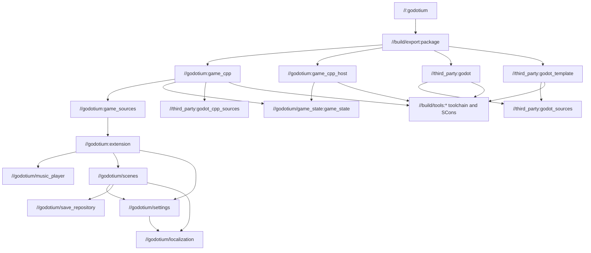

# Project structure

The repository root contains onboarding scripts, documentation and the MIT
license. `src/` is GN's source root. Run `gn` and `ninja` there; paths starting
with `//` in GN labels refer to `src/`, not the repository root.

Game code, scenes and assets live together in `src/godotium/`. Its `BUILD.gn`
assembles the game modules and target/host extension libraries. `src/BUILD.gn`
provides public build entry points; `src/build/` and `src/third_party/` contain
build infrastructure. `project.godot` remains at `src/`, so game resource paths
start with `res://godotium/`.

## The build graph



`//build/export:package` means the `package` target in `src/build/export/BUILD.gn`.
`game_cpp_host` reuses the target library on native builds; cross builds compile
an additional host library so the editor can import the native C++ scene.

`gn gen out/Default` reads `.gn`, `build/config/BUILDCONFIG.gn`, and the component
build files, then generates the Ninja graph. GN selects the current host and a
release build by default. `ninja -C out/Default godotium` executes only the
outdated actions. Python scripts implement those actions. Godot and godot-cpp
retain their upstream SCons build machinery; GN owns the top-level dependency
graph and the explicit list of our C++ sources passed to SCons.

Tool setup records the interpreter used to run it in `.tools/python_path.txt`.
GN actions and Ninja Python commands use this executable directly, including
`python.exe` on Windows. Re-run tool setup if you move or replace Python.

The C++ toolchains use real compilers, archivers, and linkers directly.
`//godotium/game_state:game_state` compiles into a static archive
without an engine build. Game extension builds link the archive for their platform.

`game_cpp_library` also accepts `static_libraries` (explicit GN target labels)
and `library_headers`. It selects the host, Windows, or Linux C++ toolchain,
builds the archives, and supplies them as tracked inputs to SCons. Library
targets must use the default `lib<target_name>.a` output convention, and their
sources must not also appear in the gameplay source manifest. Public headers
are included relative to `src`; list them in `library_headers` so changes also
invalidate the extension build. The Windows toolchain uses the same pinned
LLVM-MinGW as SCons; Linux cross compilation uses the same Docker image. See
[game_state](../src/godotium/game_state/README.md) for the first example.
Linux C++ targets track `templates/linux-image.id` as an input, so updating the
cross-compiler image also invalidates their objects and archives.

`BUILD.gn` declares targets with `sources`, `inputs`, `deps`, `outputs` and action
arguments. `.gni` is imported by build files to share arguments or templates.
`build/config/godot.gni` contains configuration; `build/game_library.gni` defines
the reusable `game_cpp_library` template. Neither creates a game instance by itself.

## Game behavior and presentation

| Location | What belongs here |
| --- | --- |
| `godotium/scenes/main_scene/` | Startup scene and native `MainScene` class (`.tscn`, `.cc`, `.h`) |
| `godotium/scenes/game_scene/` | Demo gameplay, Godot input/processing and timer presentation |
| `godotium/scenes/main_menu/` | Startup/pause actions and navigation requests |
| `godotium/scenes/save_dialog/`, `godotium/scenes/load_dialog/` | Reusable forms; exchange requests and presentation data with `MainScene` |
| `godotium/scenes/settings_scene/` | Reusable settings scene and native `SettingsScene` class |
| `godotium/music_player/`, `godotium/localization/` | Shared C++ music playback and language selection |
| `godotium/settings/` | GameSettings autoload; preferences independent of the active scene |
| `godotium/game_state/` | Engine-independent game state and simulation; a GN static library |
| `godotium/save_repository/` | Versioned save serialization and filesystem operations using Godot APIs |
| `godotium/register_types.cc` | Extension entry point; delegates registration to settings, music playback and scenes |
| `godotium/settings/register_types.cc`, `godotium/music_player/register_types.cc`, `godotium/scenes/register_types.cc` | Register each module’s native Godot classes |
| `godotium.gdextension` | Native entry point and library filenames for each platform |
| `project.godot` | Main scene, application name, window/renderer and registered translations |
| `godotium/resources/backgrounds/main_menu.svg` | Main menu background; displayed by a full-window TextureRect |
| `godotium/resources/themes/menu.tres` | Shared panel/button styles for menus and forms |
| `godotium/resources/i18n/*.po` | Locale and translated values for stable UI keys |
| `godotium/resources/audio/default_bus_layout.tres` | Master, Music and SFX audio buses |
| `godotium/resources/audio/`, `godotium/resources/icons/` | Music, sound files and icons |
| `../licenses/` (repository root) | Music provenance and asset licenses; copied to dist separately |
| `build/config/*_export.cfg` | Platform export settings and macOS signing options |
| `third_party/*_VERSION` | Upstream revisions, archive URLs and SHA-256 hashes |
| `build/tests/` | Standalone distribution and input-driven UI checks |

## Startup sequence

**The project starts at [src/project.godot](../src/project.godot).** `src/` is
both the GN source root and the Godot project root, so `res://` resolves there.
The startup scene is selected by this setting under `[application]`:

```ini
run/main_scene="res://godotium/scenes/main_scene/main_scene.tscn"
```

1. Godot reads `project.godot` and initializes the project.
2. It loads `godotium.gdextension`, whose `godotium_library_init` entry point is
   defined in `godotium/register_types.cc`. At scene initialization level,
   `RegisterSettingsTypes()`, `RegisterMusicPlayerTypes()` and
   `RegisterSceneTypes()` register the native
   classes that scene files refer to, including `GameSettings`.
3. Godot creates the `[autoload]` node `Settings` from
   `godotium/settings/game_settings.tscn`; its native `GameSettings::_ready()`
   loads and applies preferences, even if the startup scene has no settings panel.
4. Godot loads the scene selected by `run/main_scene`:
   [main_scene.tscn](../src/godotium/scenes/main_scene/main_scene.tscn). Its root
   node has native type `MainScene`; it instances the menu, game, settings and
   save/load scenes, plus the shared background and music player.
5. Godot creates the node tree and calls `_ready()` on children before their
   parent. [MainScene::_ready()](../src/godotium/scenes/main_scene/main_scene.cc)
   connects scene signals and opens the menu; child scenes initialize their own
   controls and the music node starts the first enabled track. `MainScene` pauses the gameplay
   scene until New Game or Load starts a game. `SettingsScene` displays and edits
   the values already applied by the autoload.

To change the startup screen, change `run/main_scene` in `project.godot`.
`register_types.cc` makes C++ classes available to Godot; it does not select
which scene starts. There is no standalone C++ `main()` in the extension.
The exported game packages the same project configuration and startup scene.

Each scene directory contains its `.tscn` hierarchy and matching `.cc`/`.h`
behavior. The main scene instantiates each screen as a separate scene.
`SettingsScene` owns its controls, scrollable track list and sound preview;
track toggles persist through `GameSettings`, while explicit playback requests
are connected by `MainScene` to its music player. `Open()` refreshes it from
the shared preferences and shows it, while
Back/Escape hides it and emits `closed`. `MainScene` responds by restoring the
menu and keyboard focus. The `Settings` autoload owns preference loading, application and persistence;
creating the panel never reloads the configuration or applies global defaults.
Settings can also run as a standalone scene or be
instantiated by a future pause menu without referencing main-menu nodes.

Godot's `%NodeName` lookups are scoped to a scene owner. `MainScene` accesses
`%SettingsScene`; internal controls such as `%LanguageOption` are resolved on
the settings scene itself. `MainMenu`, `SettingsScene` and the save/load forms
load the same `godotium/resources/themes/menu.tres` resource.

## Adding or changing things

**C++ file:** create a matching `.cc`/`.h` in its scene directory or shared
module (`godotium/music_player/`, `godotium/localization/`); add both to that module’s `BUILD.gn`.
`game_module` records explicit source lists and module dependencies as GN metadata.
The `//godotium:game_sources` target collects the dependency graph into
`out/<name>/gen/game_sources.json`, used by both target and host library builds.
SCons compiles the listed `.cc` files into one GDExtension; modules are not separate
shared libraries. A Ninja depfile tracks changes to all listed sources and headers,
while manifest changes track file additions/removals. List headers explicitly too.

Register new Godot-visible scene classes in `godotium/scenes/register_types.cc`,
and music playback classes in `godotium/music_player/register_types.cc`. `godotium/register_types.cc` delegates
to these functions. Localization currently has only ordinary C++ functions, so
it needs no Godot class registration. To add another module, give it a `BUILD.gn`
using `game_module`, connect it through `deps`, and delegate registration from the
root if needed. If new code uses more engine classes, add them to
`build/config/cpp_profile.json` (including required API argument/return types).

**Scene, image or audio:** place scenes beside their C++ code under
`godotium/scenes/` and shared assets under `godotium/resources/`; reference them from a scene or C++,
and list it in `build/export/BUILD.gn`. Only files in that list are copied into the staged export project. The same list
tells Ninja when to re-export, so an unlisted asset cannot silently ship. Keep each editor-generated `.import` sidecar in Git and in the same export list.
These files carry import options and resource UIDs; `.godot/` remains a disposable cache.
Export rejects listed assets whose existing sidecars were omitted. For third-party assets, add source and license details
under the repository-root `licenses/` directory; add any new distributed notices to the package outputs
and distribution tests. Replace the demo playlist paths in `godotium/music_player/music_player.cc`
and its visible credits in `godotium/scenes/settings_scene/settings_scene.tscn` when replacing music.

**UI text/language:** use a stable key in the scene or `tr("KEY")` in C++, then add
the translation to each `godotium/resources/i18n/*.po`. A new locale needs a PO
file with a `Language` header, an autonym in `LANGUAGE_NAME`, and entries in `project.godot` and
`build/export/BUILD.gn`. The language menu discovers registered locales automatically.

**Dependency:** pin its version and checksum under `third_party/`. Cached Godot
sources record their version, URL and archive checksum; a changed pin fails with
an instruction to move the old cache aside before fetching the new version.
Legacy caches are adopted after checking `version.py` (this does not authenticate
the existing tree against an archive checksum). Describe the
fetch/build action in `third_party/BUILD.gn` and connect consumers through `deps`.
Also add the actual compiler/linker integration to the C++ build action if needed:
a GN dependency alone does not link a library. Include required license notices
in the exported distribution.

**Build-wide option:** declare it in `build/config/godot.gni`. Put platform export
behavior in the relevant export preset. Runtime user preferences belong in C++
and are saved in `user://settings.cfg`; they are separate from GN build arguments.

Useful inspection commands, from `src/`:

```sh
gn desc out/Default //:godotium deps --tree
gn desc out/Default //godotium:extension deps --tree
cat out/Default/gen/game_sources.json
gn desc out/Default //build/export:package outputs
gn args out/Default --list --short
ninja -C out/Default -n godotium
```

## Generated files

`.tools/`, `src/.tools/`, downloaded engine/bindings source trees, `.godot/`,
`bin/` and `out/` are ignored. `out/<name>/dist/` contains only the files to
ship. The editor, runtime template and intermediate objects stay outside it.
The `prepare_editor.py` helper puts a host-native library into `src/bin/` when
opening the source project in the editor. Export stages use isolated copies.

GitHub Actions is defined in `.github/workflows/build.yml` and runs only through
manual `workflow_dispatch`. Publishing commits does not trigger it.

## Why resources and licenses are separate

`godotium/scenes/` contains scene behavior and layout. Shared C++ services
live in `godotium/music_player/` and `godotium/localization/`, while `godotium/resources/`
contains reusable data: music, sounds, translations, themes and icons. C++ music
playback is in `godotium/music_player/`; the audio files it loads are in `godotium/resources/audio/`.
Likewise, language selection code lives in `godotium/localization/`, with translated
strings in `godotium/resources/i18n/`. Scene files remain beside their matching C++ class.

Licenses are distribution notices, not gameplay assets. Root `licenses/` contains
music attribution and CC0 text. Export copies these outside the PCK, alongside
Godot/godot-cpp notices taken from their pinned source trees and the root MIT
`LICENSE`. On Mac they live in the app's Resources/licenses directory; on Windows
and Linux they live in dist/licenses beside the executable.

The Godot editor ignores `build/`, `third_party/` and `out/` via `.gdignore` files.
The marker `src/out/.gdignore` is tracked; the build outputs below it are ignored
by Git. Keep build directories under `out/`. Export never copies `src/`
recursively: it stages only the resource list from `build/export/BUILD.gn`, plus
the built native libraries. This keeps compiler output and source code out of
the exported game and avoids scanning the engine source tree in the editor.

See [Scene architecture](scene-architecture.md) for the runtime boundaries,
save/load flow and contracts used to replace the demo game.

## Desktop icons

The Windows template build reads `godotium/resources/icons/godotium.ico` as a
tracked GN input and compiles it into the runtime resource section. Only the
template's icon resource is changed; editor branding is unchanged. Regenerate
the committed ICO from the SVG using `build/scripts/generate_windows_icon.gd`
after changing the artwork (command in README). Export preserves these resources.

Linux export copies the SVG and files from `build/linux/` beside the executable.
The desktop entry supports system packaging; no user-level installer is bundled.
Steam launches the executable through its own launch configuration. These
packaging files stay outside the PCK. Distribution tests compare Windows ICON
payloads to the source ICO and the exported Linux SVG to the source icon.
