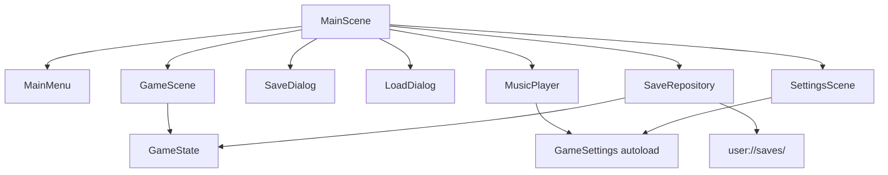

# Scene architecture

`MainScene` is the composition root. It connects scene signals, selects the
active screen and sends save/load requests to `SaveRepository`. It looks up only
scene roots and calls their public C++ methods. Each scene owns its controls,
translations, focus and input handling, with `%UniqueName` lookups scoped to that
scene. Child scenes do not look up parents or sibling controls.

Arrows represent dependencies. User actions travel back to `MainScene` through
signals; scene-to-scene communication is routed there.

| Component | Responsibility | Public contract |
| --- | --- | --- |
| `MainScene` | Compose screens, pause/resume, route requests and results | Connects signals in `_ready()`; `ShowScreen()` ensures a single active screen |
| `GameScene` | Run the demo and display its timer | `StartNew()`, `Restore(GameState)`, `GetState()`, `SetRunning()`; emits `pause_requested` |
| `MainMenu` | Display startup/pause actions and status; own keyboard focus | `Open(can_resume)`, `FocusAction()`, `SetStatus()`; emits action request signals |
| `SaveDialog` | Edit a name; offer create/overwrite actions; show validation/errors | `Open(name, entries)`, `MarkNameTaken(name)`, `SetStatus()`; emits `save_requested(name, overwrite)` and `cancelled` |
| `LoadDialog` | Display supplied entries and request the selected id | `Open(entries)`, `SetStatus()`; emits `load_requested(id)`, `delete_requested(id)` and `cancelled` |
| `SettingsScene` | Edit user preferences | `Open()`; emits `closed` and `play_track_requested(index)`; edits `GameSettings` autoload |
| `GameState` | Represent and validate the demo's persistent state | Engine-independent C++ value; `Advance(delta)` and `IsValid()`; no nodes, file paths or global state |
| `SaveRepository` | Serialize, list, validate and atomically replace saves | `List()`, `Load(id, result)`, `Save(name, state, overwrite)`, `Delete(id)`; no scene-tree or UI dependencies |

Each screen has its own `.tscn`, `.h` and `.cc` under
`src/godotium/scenes/<scene_name>/`. Scene-specific methods and signals are
implemented in native C++; GDScript is used by the external test harnesses.
`GameState` lives in `godotium/game_state/`, storage in `godotium/save_repository/`.
`GameState` is an independent GN static library linked into the GDExtension;
`SaveRepository` is a normal game module compiled by SCons. Settings are also a
normal module, with normalization and persistence in `GameSettings`.

## State and lifetime

`MainScene` owns navigation state (`screen_`, whether a game exists, and the
current save name). Its child `GameScene` owns the live `GameState` value.
`GetState()` returns a copy for saving; `Restore()` validates a value before
replacing the live state. The coordinator controls processing explicitly:
hiding a Godot control by itself does not pause its `_process()` callback.

All screens and the shared background are instantiated once and reused.
`GameScene` has no separate background. The same `MainMenu` hides Resume/Save
before a game starts and shows them as its first two actions while paused. Their `Open()` methods prepare
them for each visit: the menu restores focus, save/load forms reset transient
form state, and settings refreshes controls from `GameSettings`. The settings
autoload lives for the project session and applies preferences before any scene
opens. A settings panel can therefore be reused in a different menu, provided
the project retains that autoload.

This is a small, concrete example: add game rules to the value library, engine
interaction to the gameplay scene, and navigation to the coordinator. Keep
domain state instance-owned so new games, loaded snapshots and multiple game
instances use the same API. Introduce additional services or interfaces when a
game needs a second implementation or a separate lifetime.

## Music controls

`MusicPlayer::GetTracks()` defines stable IDs, titles/credits and resource paths.
`SettingsScene` builds track controls from this catalog and saves enabled flags
through `GameSettings`. The settings autoload emits `playlist_changed` so players
skip disabled tracks immediately, stop when none are enabled, and resume when a
track becomes enabled. Stable IDs keep preferences independent of list order.

The panel emits `play_track_requested(index)` for an explicit play action;
`MainScene` connects it to its own `MusicPlayer::PlayTrack()`. It does not search
for a player from inside the settings scene. A standalone settings panel still
edits preferences and needs its owner to connect playback requests.

The scroll viewport fits five 36-pixel rows. Additional tracks scroll instead of
increasing the settings panel height. Add new audio assets and import sidecars to
`build/export/BUILD.gn` along with extending the catalog.

## Save and load flow

1. `MainMenu` emits `save_requested`. `MainScene` pauses the game and calls
   `SaveDialog::Open()` with the previous name and presentation entries for named
   saves. Selecting a row fills the name field; editing it or selecting another
   row updates Save/Overwrite availability. Save is the default when available;
   otherwise Cancel is the default, including Enter in the name field.
2. The form emits the entered name and whether the dedicated Overwrite button
   was used. It does not inspect the filesystem or know about the timer.
3. `MainScene` passes the name and `GameScene::GetState()` to the repository. An
   unexpected existing slot returns `kNeedsOverwrite`, so the coordinator marks
   that name as taken. The form disables Save and enables Overwrite, without
   automatically replacing the file. Overwrite itself requires no extra prompt.
   A successful write returns to the paused menu; a failure
   stays in the form with the name intact.
4. Loading starts with `SaveRepository::List()`. `MainScene` converts those
   results to presentation entries (opaque id, name, summary, date, availability)
   and supplies them to `LoadDialog`.
5. Confirming or activating an entry emits only its id. The coordinator reloads and validates
   the file, passes the state to `GameScene::Restore()`, then resumes. A changed
   or damaged file produces a form error without replacing the running state.

The load form also confirms deletion in a modal overlay above the visible list,
displaying the selected name, elapsed time and modification date before
emitting `delete_requested(id)`. The coordinator calls `SaveRepository::Delete()`
and refreshes the list on success or shows an error on failure. Damaged saves
remain selectable for deletion. The overlay blocks the underlying controls and
keeps keyboard focus on its own buttons, initially Cancel. Esc or Cancel
dismisses the confirmation without
leaving the list; deleting a file never changes the live game state.

Esc is handled by the visible screen. The game requests pause, the menu requests
resume, and the forms cancel. Input is marked handled before emitting a signal,
so switching screens cannot also deliver the same key to the newly opened screen.
The timer does not run while a menu or form is open.

Storage uses a version-1 configuration file. A trimmed, case-normalized name is
hashed to obtain the slot filename; display names never become paths. Loading
checks the format version and `GameState::IsValid()`. The original unnamed
`savegame.cfg` remains loadable. `GODOTIUM_SAVE_DIR` and `GODOTIUM_SAVE_PATH` are
resolved only inside the repository.

### Save format versions

`SaveRepository` uses `kSaveFormatVersion` for both writing and checking the
on-disk schema. It is independent of game releases and does not increase each
time a player saves. Version 1 is sufficient for the current timer state.
Compatible additions with defaults can retain that version; incompatible changes
need a new version and explicit conversion of older data in the loader.
Currently the loader accepts only version 1 and prevents loading saves with unsupported
versions. Changing the constant alone does not migrate existing saves.

## Replacing the demo game

Start with `game_state/game_state.h` and `.cc`: replace the elapsed-time example
with your persistent state and rules. Then adapt `game_scene` to collect input,
advance those rules and display the result. Time progression currently lives in
`GameState::Advance()`; Godot string formatting stays in `GameScene`.

Update `SaveRepository` serialization and format version when the save schema
changes, preserving compatibility or adding a versioned migration. Keep domain
validation in `GameState::IsValid()` and file-format checks in the repository.
Adapt `GameScene::GetStateSummary()` for the game screen and load-list preview.
Menu and dialog controls can remain unchanged because they communicate through
requests and presentation data. For a game that needs newly instantiated levels,
change their creation and lifetime in `MainScene` while retaining these contracts.

When adding a scene, register its native class in `scenes/register_types.cc`,
list C++ sources in `scenes/BUILD.gn`, add any Godot API classes to
`build/config/cpp_profile.json`, and list its `.tscn` in `build/export/BUILD.gn`.
Instance it in the composition root and connect its signals there.

The source checks exercise the full game loop and each new scene without
`MainScene`, including two save-dialog instances with independently scoped node
names. The distribution checks also run those scene contracts against the
exported resource pack. Run the existing source/distribution commands in README
when changing scene contracts.

See [GameState library](../src/godotium/game_state/README.md) for independent
build commands and the boundary for a future external game-logic library.
